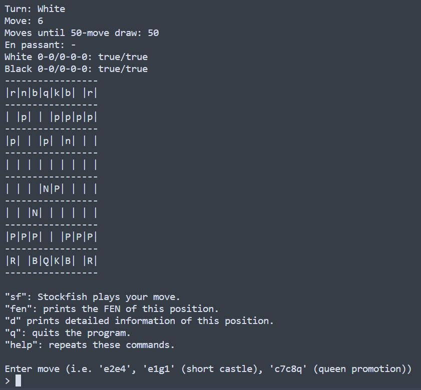
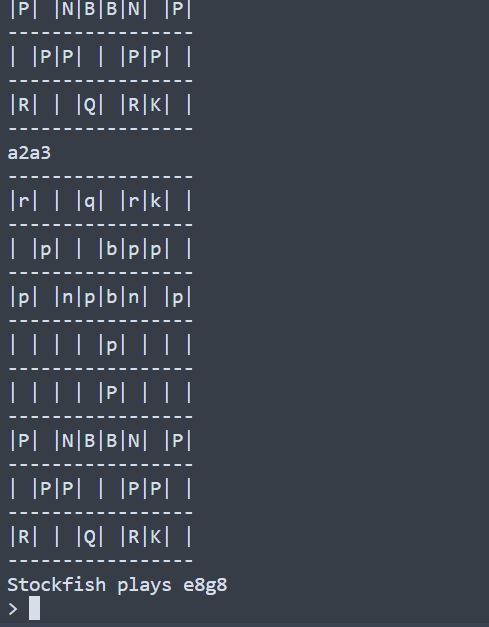

<h1>chess_cli</h1>

The purpose of this project is to program a lightweight command-line based chess interface for personal use.

Options are given to interface with a dumbed-down Stockfish engine (10-move depth search), loading/generating FENs for positions on the fly, and toggling off the graphical board for "blindfolded" play.

Move notation complies with the UCI protocol which allows this program to interface with Stockfish (or any chess engine also following UCI protocol). Examples:
- `e2e4`: White pawn from e2 to e4 (assuming start position)
- `e1g1`: White kingside castles
- `c7c8q`: White promotes their c pawn to a queen

Future directions involve adding more sophisticated interfacing with Stockfish, adding a GUI, including chess variants, etc. More in the To-do...




<h2>Motivations</h2>

- Application of expanding CS knowledge towards an interesting project
- Programming an interface that motivates my own chess learning (i.e. by use of blindfold, algebraic notation, practice vs. engine, etc.)

<h2>A note on FEN</h2>

FEN (Forsyth–Edwards Notation) is a standard notation that represents the state of any given chess position. It is a one-line string that encodes the board position, castling availability, turn, and more. This notation can be interpreted by most modern chess engines and GUIs to load positions.

Here are some example FENs to try out:

`rnbqkb1r/1p2pppp/p2p1n2/8/3NP3/2N5/PPP2PPP/R1BQKB1R w KQkq - 0 6`

`r1bqkb1r/pppppppp/2n2n2/8/8/2N2N2/PPPPPPPP/R1BQKB1R w KQkq - 4 3`

`3r1r2/5p1k/6p1/2b1Bb2/2Pp1QPP/3P4/8/4R1K1 b - - 0 1`

`r2qnrk1/ppp4p/3p2p1/3Pb3/4N3/4Q3/PPP1B1PP/3R1RK1 w - - 0 2`

`6k1/p1r1r2p/n2p2p1/3P4/4P3/Pqp2P1Q/1b2BP2/4K1RR w - - 1 2`

`3rr1k1/1p6/1qp3Pp/4nP2/pP2p3/P3NbP1/1BP3B1/R1Q4K w - - 1 33`

`1kbr1n1r/p7/3qp1p1/3p3p/PPP4P/5NQ1/3N1PP1/2R1R1K1 w - - 2 27`


<h2>Setup</h2>

Open a bash instance and navigate to your desired directory.
Clone the repo:
```bash
git clone https://github.com/liphenste/chess_cli
cd chess_cli
```
Run an npm install to get the stockfish.js dependency:
```bash
npm install
```
Navigate to src/ and compile all the game files:
```bash
cd src
make
```
The make should have generated a chess_cli.exe file. All that's left is to run it:
```bash
./chess_cli.exe
```

<h2>To-do</h2>

- Improve error handling
- MVC Framework
  - Chess960 Model, Three-check Model
  - GUI View, custom themes
  - standard algebraic notation Controller, GUI Controller
- Run Stockfish.js concurrently with interface, run an infinite move search
- Connect to other engines, run performance metrics against Stockfish
- 'Analysis mode': Consider multiple lines with respective evaluations
